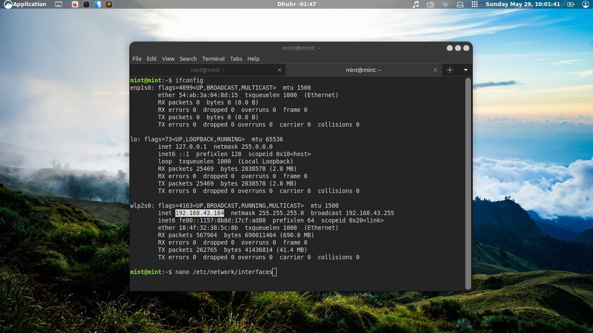
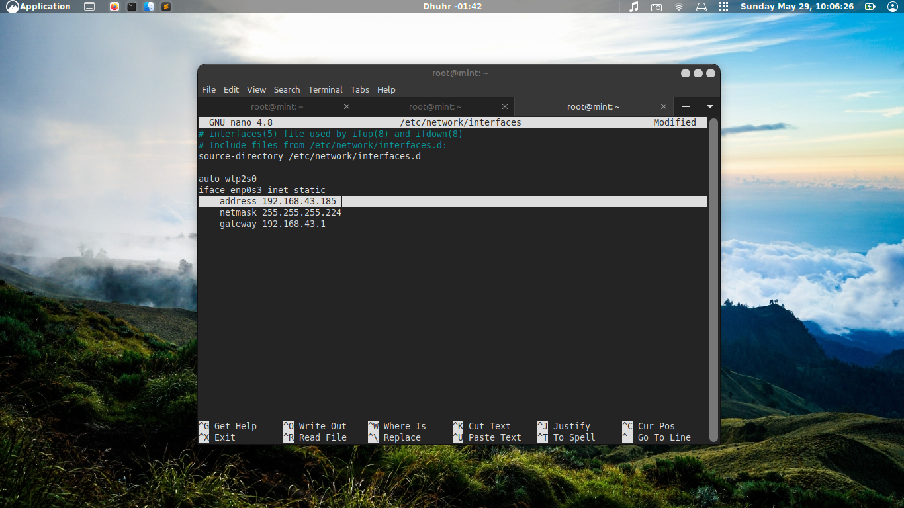
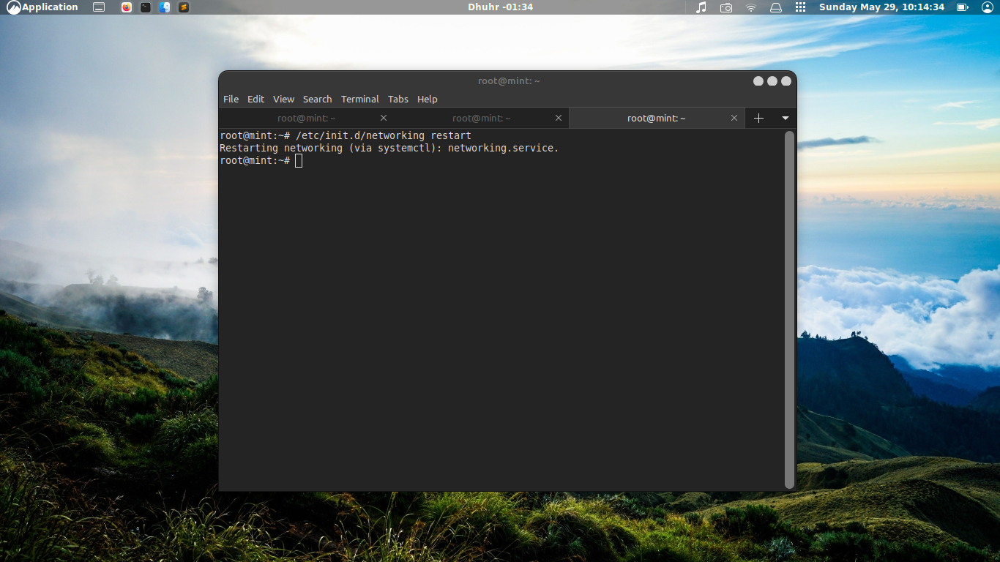
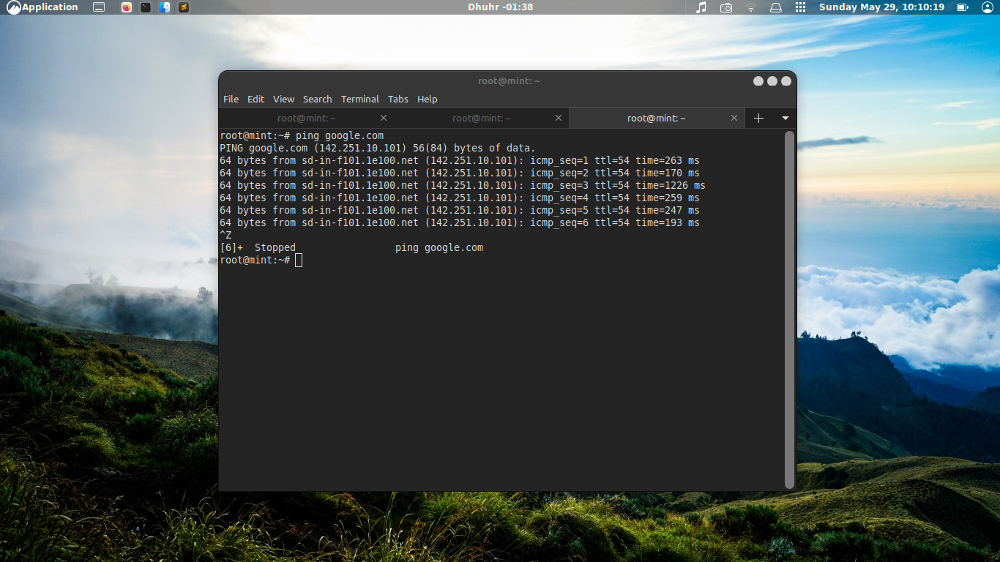
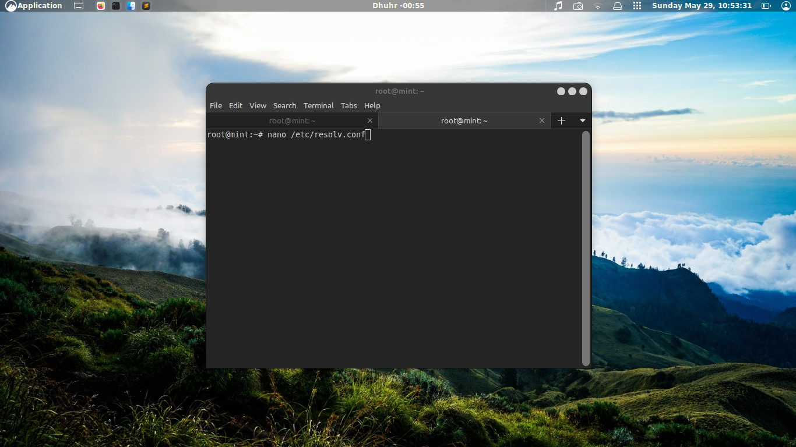
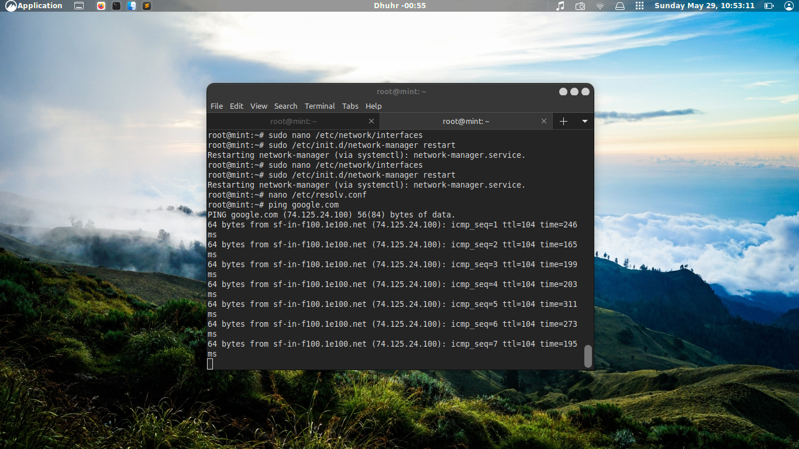
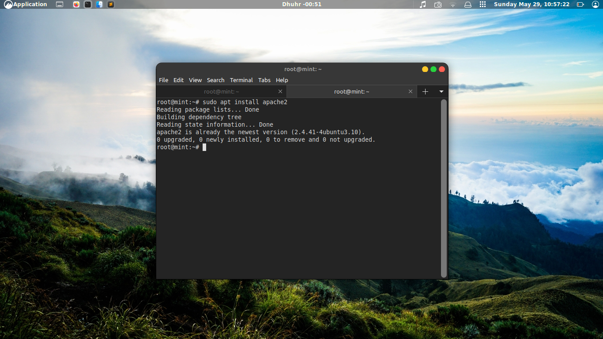
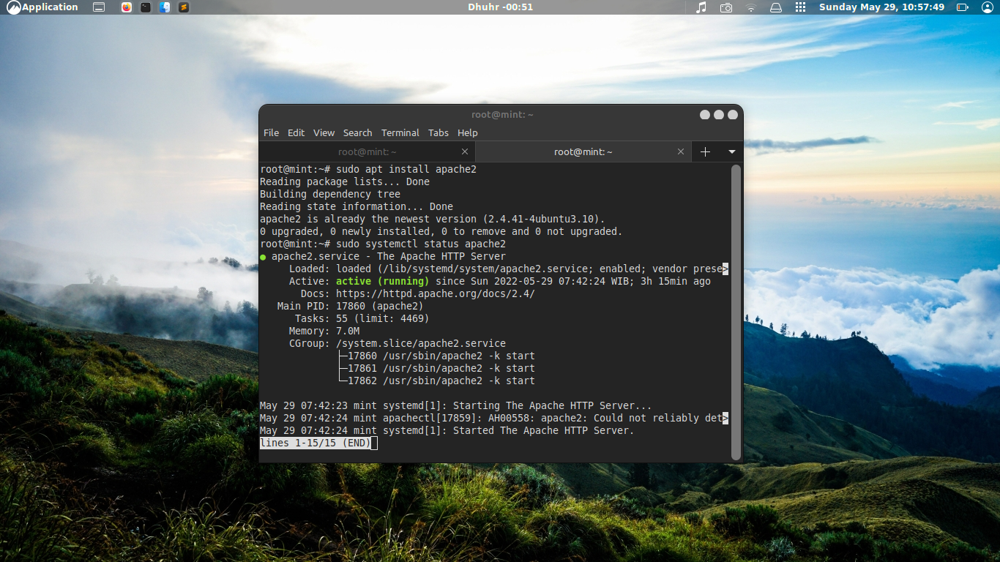
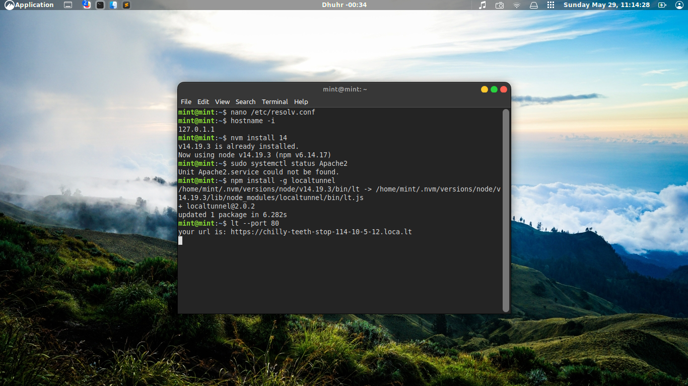
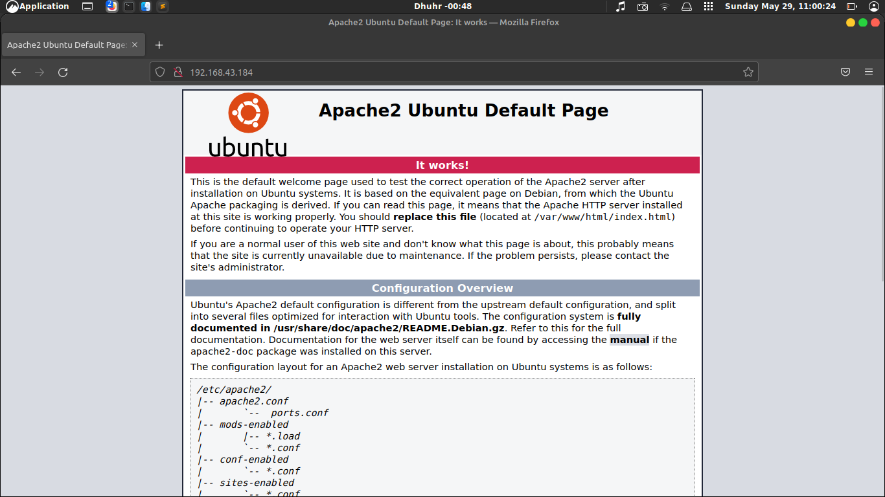

# Task-Day-2
Konfigurasi jaringan, hingga tunneling

## Project Management

Konfigurasi IP server dari IP lama ke IP baru, kemudian melakukan instalasi web server apache2 hingga dapat di akses secara public dengan localtunnel

- [1] Definisikan apa itu Computer Network menurut pemahamanmu
- [2] Buatlah daftar perintah linux yang membantumu untuk memanagement linux server
- [3] Ganti IP server lama menjadi IP server baru
- [4] Lakukan remote server tersebut menggunakan IP baru
- [5] Install aplikasi web server apache di linux server
- [6] Akses aplikasi web server apache2 menggunakan browser melalui IP
- [7] Buatlah localtunnel pada web server apache2
- [8] Akses aplikasi web server apache2 menggunakan localtunnel lewat HP

### Solve ###

### =>[1] Computer Network Adalah jaringan komputer yang terkoneksi antara 2 komputer atau lebih yang saling terhubung sehingga dapat saling berbagi informasi.

### =>[2] command atau perintah adalah sebuah bahasa untuk berinteraksi dengan sistem operasi agar bisa melaksanakan tugasnya dengan spesifik.
berikut beberapa daftar perintah dasar :

1. pwd 

Ketika Anda ingin membuat, melihat, atau menghapus files, Anda tentunya perlu memastikan terlebih dahulu kalau Anda sudah berada di direktori yang tepat bukan?

Nah, pwd atau print working directory akan memberikan informasi mengenai direktori aktif yang sedang Anda akses. Hasil dari command adalah seperti /home/username.  

2. cd

Jika direktori yang Anda akses saat itu ternyata belum tepat, Anda bisa memanfaatkan perintah cd (change directory) untuk mengubah atau membuka direktori tertentu.

Contohnya, Anda sedang berada di direktori Home dan ingin mengakses folder Downloads. Nah, Anda hanya perlu menulis perintah cd Downloads. 

3. mkdir

Perintah mkdir (make directory) berfungsi untuk membuat folder atau direktori baru. Untuk menambah direktori Movies, misalnya, Anda bisa menulis mkdir Movies.

Selain itu, Anda juga bisa membuat direktori dalam direktori lain yang sudah ada. Caranya, ketik nama direktori lama diikuti dengan direktori baru, seperti mkdir Movies/Actions.    

4. rmdir

Jika Anda ingin menghapus direktori, Anda bisa menggunakan perintah rmdir. Namun perlu diketahui, perintah ini hanya bisa menghapus direktori yang masih kosong.

Sebagai alternatif, Anda juga bisa menulis rm -r untuk mendapatkan fungsi yang sama seperti rmdir.  

Namun harus diingat, Anda perlu berhati-hati dalam menggunakan rm -r. Pastikan Anda telah menulis nama folder/file setelah perintah rm -r (contohnya seperti: rm -r Movies/Actions).

Jika Anda lupa mencantumkan nama folder/file tersebut, maka yang terjadi adalah Anda akan menghapus seluruh direktori pada server.

5. rm 

Kalau Anda ingin menghapus direktori beserta seluruh files yang ada di dalamnya, Anda bisa memanfaatkan perintah rm.

Sedangkan bagi Anda yang ingin menghapus satu file secara khusus, Anda bisa menambahkan nama file tersebut setelah perintah rm (contoh: rm filename).

Tidak hanya itu, Anda juga bisa menghapus banyak files dalam waktu bersamaan dengan menulis rm filename1 filename2 filename3.

6. cat

Sebagaimana namanya, perintah cat (concatenate) berfungsi untuk menggabungkan files.

Contohnya, tulis cat filename1 filename2>filename3 untuk menggabung filename1 dan filename2, dan menjadikannya sebagai filename3.

Di samping itu, cat juga menawarkan beberapa fungsi lain, seperti mengetahui konten suatu file (contoh: cat file.txt) dan membuat file baru (contoh: cat > newfile).  

Baca Juga: Mengenal Apa Itu Data Center [Pembahasan Lengkap] 

7. echo

Perintah echo menawarkan banyak fungsi, salah satunya adalah untuk memasukkan data (yang biasanya berbentuk teks) ke dalam file.

Sebagai contoh, Anda ingin menambah teks hello there, welcome! ke file bernama sample.txt. Nah untuk melakukannya, Anda bisa menulis echo hello there welcome! >> sample.txt. 

8. ls

Bagi Anda yang ingin mengetahui konten apa saja yang terdapat dalam working directory atau direktori aktif, Anda bisa menggunakan perintah ls.

Selain itu, Anda juga bisa melihat hidden files dengan perintah ls -a, atau melihat konten di direktori lain dengan menulis nama direktorinya seperti ls /home/username/Documents.

9. locate

Anda merasa bingung di mana suatu file tersimpan? Tenang, Anda bisa memanfaatkan perintah locate.

Jika Anda lupa dengan nama file tersebut, Anda bisa menambahkan -i, sehingga perintahnya menjadi locate -i filename.

Sedangkan jika nama file yang dicari lebih dari satu kata, Anda perlu menambahkan asterisk (*) ke dalam perintahnya (contoh: locate -i data*sekolah).   
10. find

Anda juga bisa menggunakan find command untuk menemukan suatu file atau direktori. Bedanya, pencarian dengan perintah ini hanya akan difokuskan ke direktori tertentu.

Misalnya Anda menulis find /nama direktori/ -name sample.txt, maka pencarian tersebut hanya dilakukan pada direktori home yang dituliskan.

11. touch

Perintah touch bisa digunakan untuk membuat file baru dengan berbagai jenis format; seperti txt, zip, maupun html.

Untuk membuat file dengan format teks di direktori Documents, misalnya, Anda dapat menulis perintah touch /home/username/Documents/sample.txt,.

12. sudo

Singkatan dari SuperUser Do; sudo adalah sebuah perintah dasar Linux yang memungkinkan Anda menjalankan berbagai macam tasks yang memerlukan root atau administrative permissions.

Contoh perintahnya adalah sudo visudo, yang berfungsi untuk mengedit file konfigurasi atau sudoers.

13. cp

Perintah cp digunakan untuk menyalin file dari direktori aktif ke direktori lain. Contohnya, Anda ingin menyalin sample.txt ke direktori Documents.

Nah, Anda bisa menulis cp sample.txt /home/username/Documents/. 

Baca Juga: Kenali Apa Itu Dedicated Server, Kelebihan, dan Kekurangannya

14. mv

Di sistem operasi Linux, Anda juga dapat memindahkan file ke direktori lain dengan bantuan perintah mv.

Sebagai contoh, Anda menulis mv sample.txt /home/username/Documents/ untuk memindahkan sample.txt ke direktori Documents.

Tidak hanya itu, mv juga bisa dimanfaatkan untuk mengubah nama file. Sebagai contoh, Anda ingin mengganti nama file txt Anda, maka perintahnya akan menjadi mv oldsample.txt newsample.txt.  

15. ping

Sering mendengar ping command? Atau malah sering menggunakannya? Perintah dasar Linux yang satu ini menawarkan fungsi untuk mengetahui atau mengecek koneksi Anda ke server.

Jika Anda menulis ping google.com, contohnya, Anda nantinya akan memperoleh detail informasi mengenai koneksi Anda ke Google.  
16. zip dan unzip

Perintah zip dan unzip tentunya sudah tak asing lagi di telinga Anda bukan? Zip command digunakan untuk mengompres file menjadi zip archives.

Contoh perintahnya seperti zip -r archivename.zip filename1 folder2. Sebaliknya, unzip berfungsi untuk mengekstrak zip archives (contoh: unzip archivename.zip). 

17. hostname

Ada beberapa informasi yang bisa Anda dapatkan dari perintah hostname ini. Salah satunya adalah mengenai nama DNS (Domain Name System).

Di samping itu, Anda juga bisa mengetahui IP address Anda dengan menambahkan -i atau -I, sehingga perintahnya menjadi hostname -i atau hostname -I.   
(sumber: https://www.goldenfast.net/blog/perintah-dasar-linux/ )

### =>[3] merubah ip server 
seperti biasa ikuti step by step yah
pertama : cek ip terlebih dlu

masukan printah sperti diatas kemudian set ip nya

cek dengan perintah dibawah ini

cek ping google.com konek atau enggak.

kalau belom konek bisa di ganti dngn perintah dibawah ini kmudian sesuiakn ip sperti diatas

gambar urutan nya akan jadi sperti dibawah ini

### =>[4]  install Apache2
instal apt nya dlu

kemudian liat status configurasinya

di lanjutkan lt --port 80 untuk memuncul url milik kalian 

cekidot langsung copy paste ajah

done paham kan, paham lah masa enggak
NB : step by step yh 