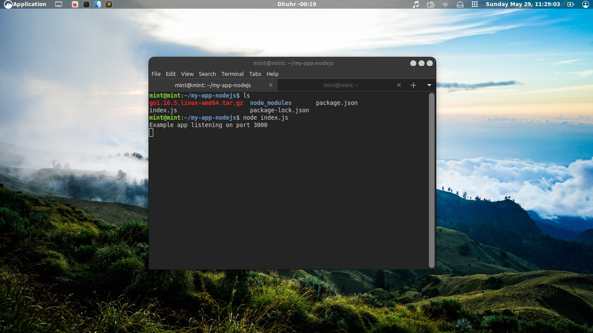
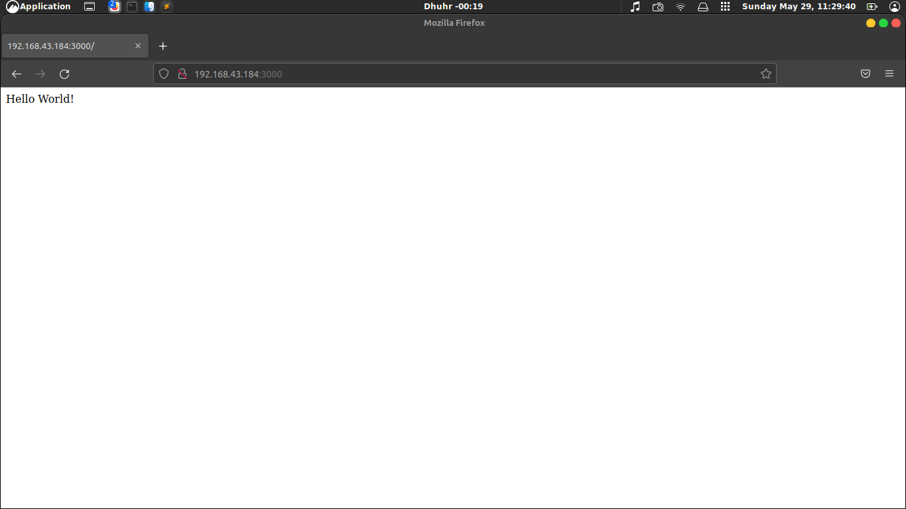
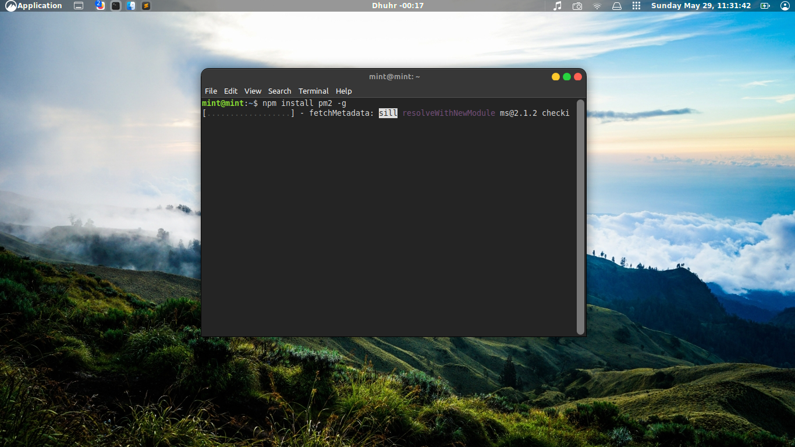
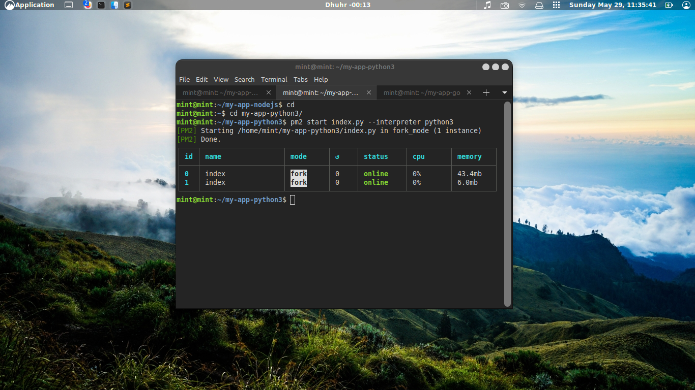
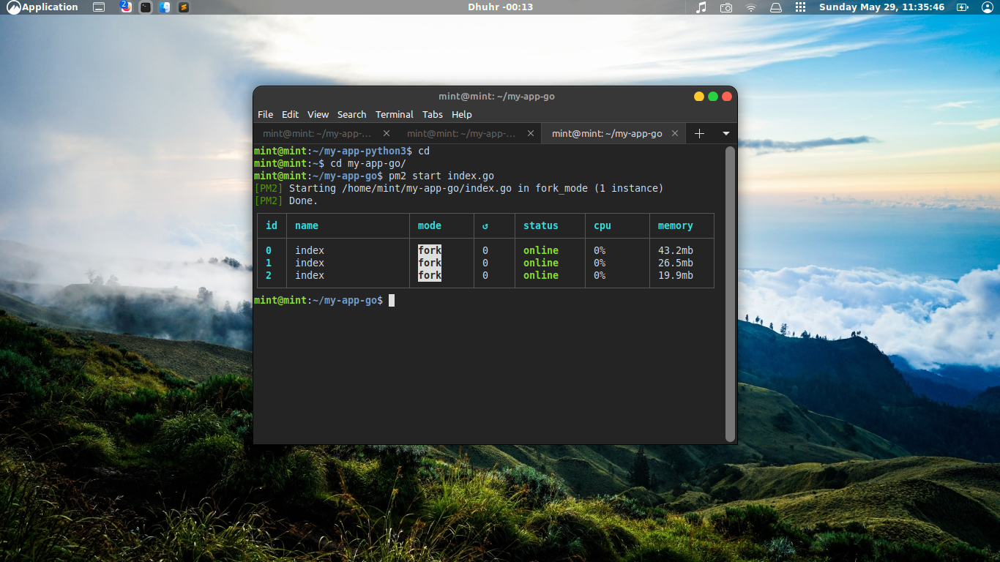
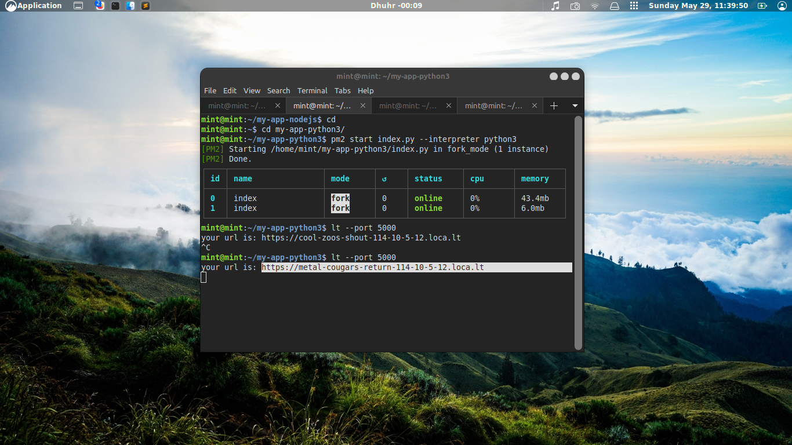
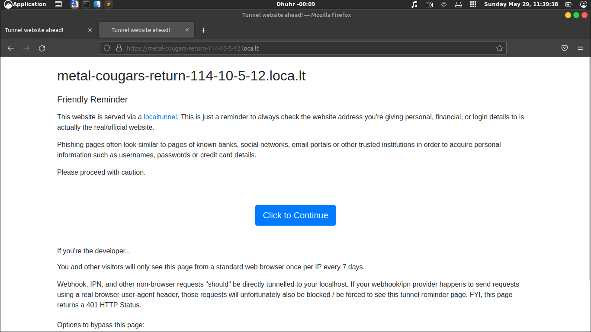
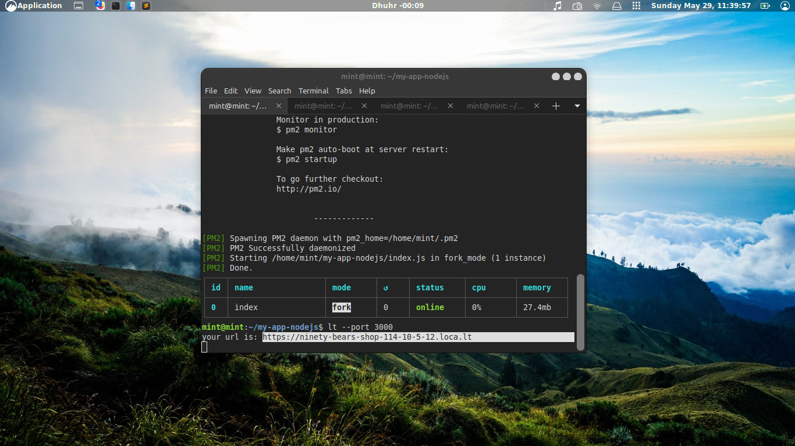
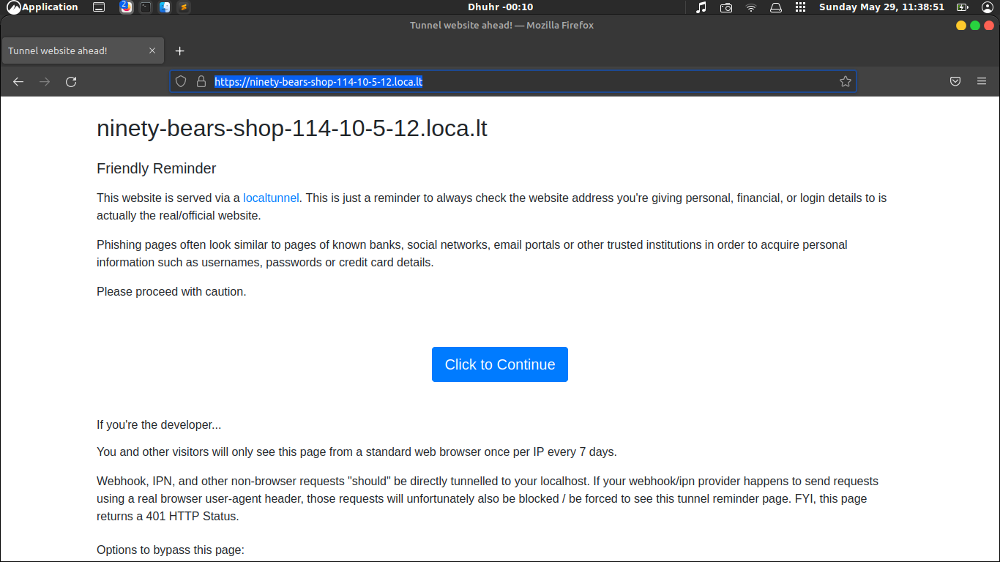

# Task-Day-3
Konfigurasi jaringan, hingga tunneling

## Project Management

Instal semua kebutuhan aplikasi yang dibangun dengan NodeJS, Python dan Go hingga aplikasi tersebut dapat di akses melalui web browser.

- [1] Definisikan apa itu Application menurut pemahamanmu
- [2] Buatlah sebuah aplikasi sederhana menggunakan NodeJS, Python dan Go
- [3] Siapkan environment untuk aplikasi NodeJS, Python dan Go
- [4] Jalankan aplikasi NodeJS, Python dan Go pada server dan pastikan dapat di akses
- [5] Aplikasi yang sudah berhasil di akses, perlu untuk dikonfigurasi agar dapat berjalan secara daemon menggunakan PM2
- [6] Gunakan localtunnel agar aplikasi tersebut dapat di akses secara publik
- [7] Aplikasi yang sudah berhasil di konfigurasi dengan PM2 wajib dapat di akses melalui web browser

### Solve ###

### => [1] Application adalah sebuah program perangkat lunak yang di buat untuk melakukan tugas khusus maupun fungsi yang lain secara mandiri atau secara bersamaan.

### => [2]  

seblumnya jalankan dlu nodejs kalian untuk bisa berjalan bersama dengan pm2
ikuti alur dbwah ini yk

kemudian instal pm2 nya

diikuti dengan python juga golang. jalankan perintahnya

sperti diatas jalankan golang

jangan lupa ya setiap link nya copy paste ajh

kmudian liat pm2 status

done smuanya berjalan bersama-sama horey