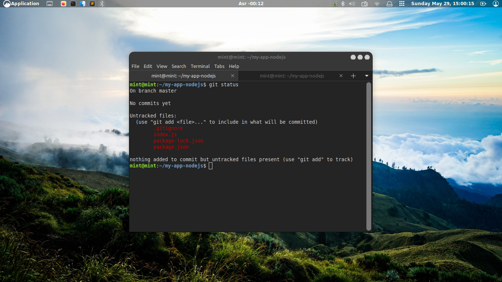
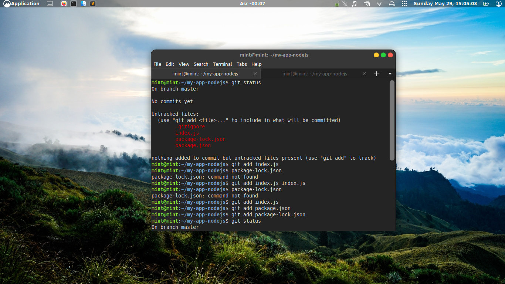
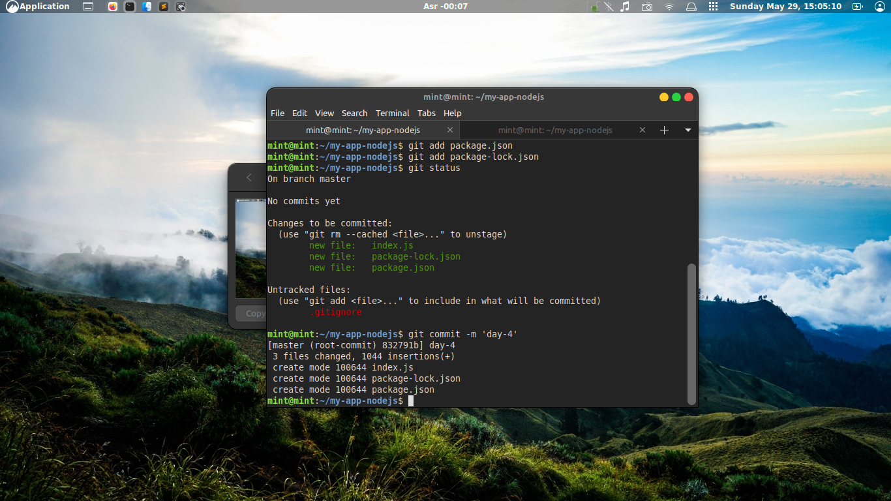
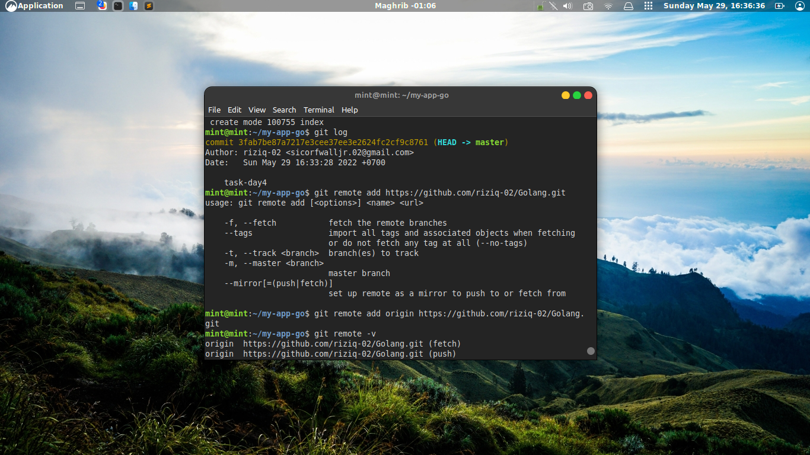
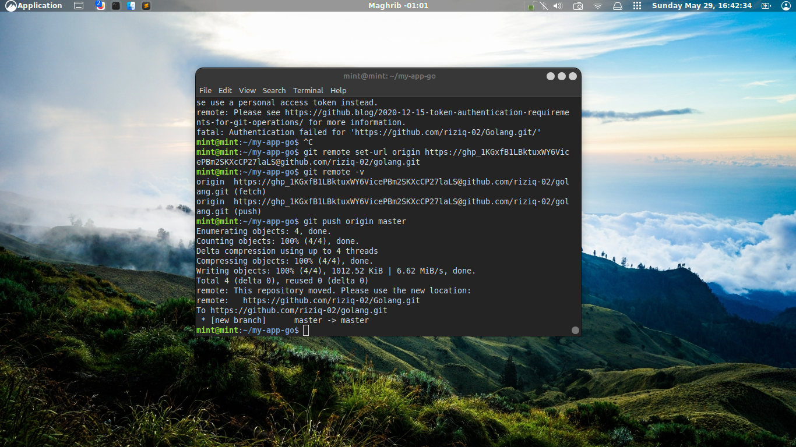
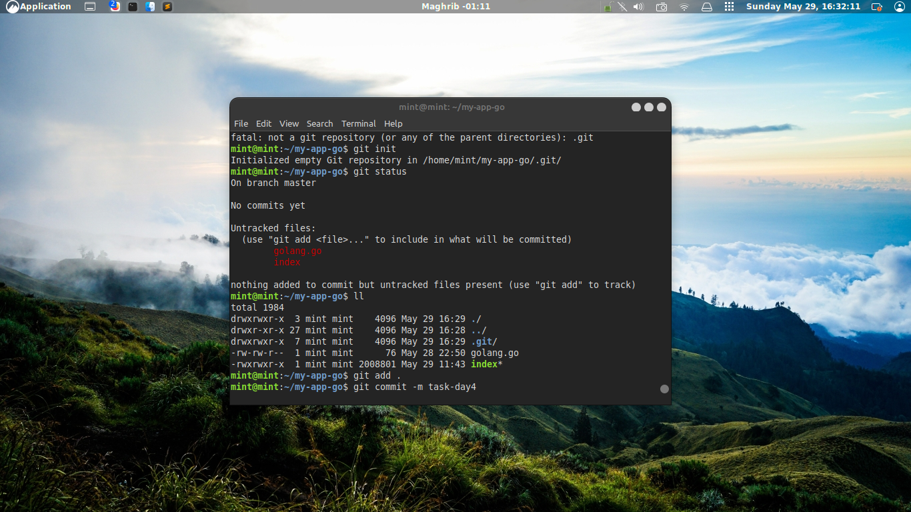
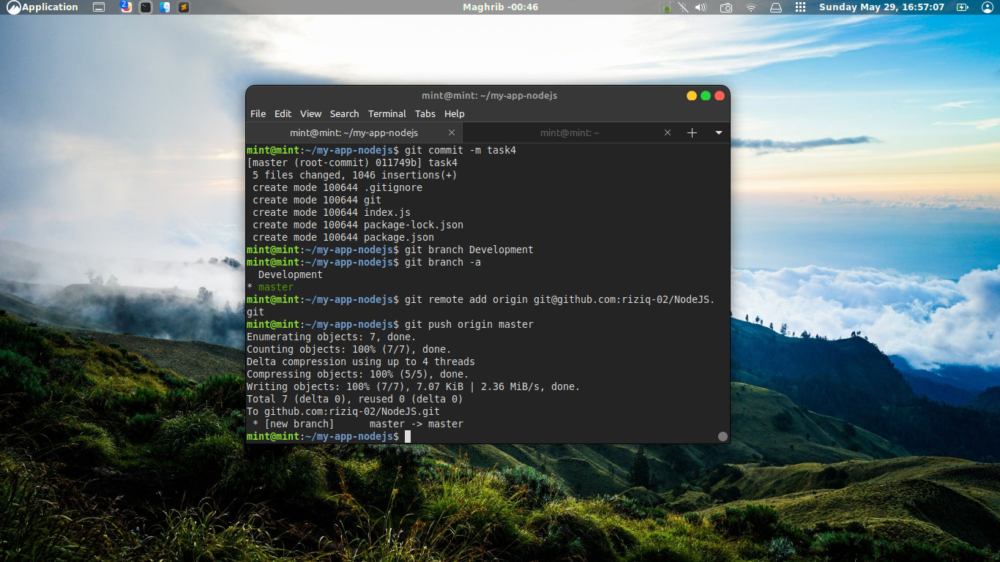
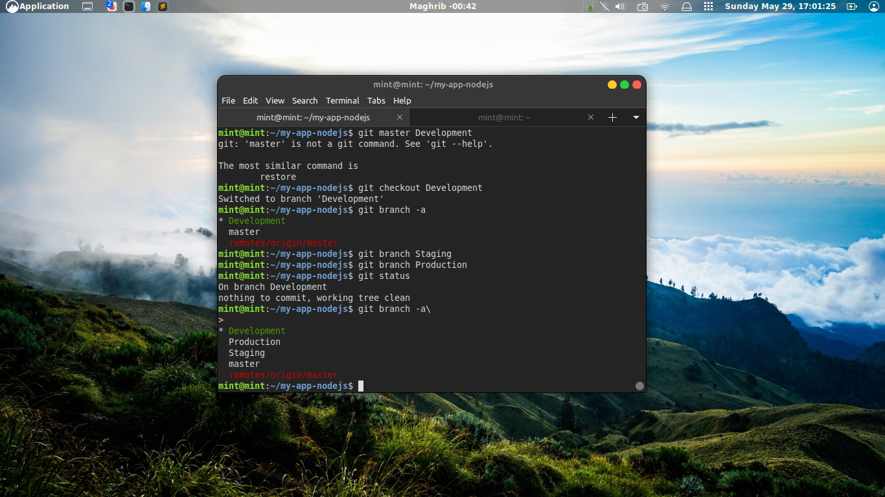
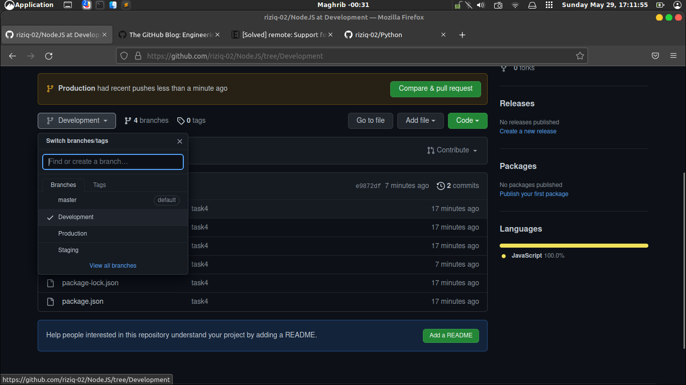

!Img 1# Task-Day-4
Konfigurasi jaringan, hingga tunneling

## Project Management

Melakukan versioning menggunakan git pada semua aplikasi (NodeJS, Python dan Go).

- [1] Definisikan apa itu Git menurut pemahamanmu
- [2] Buat 3 buah repository untuk masing-masing aplikasi (NodeJS, Python dan Go)
- [3] Buatlah 3 buah branch pada masing-masing aplikasi tersebut yaitu development, staging dan production
- [4] Pada setiap aplikasi tersebut lakukan push ke semua repository yang telah dibuat

###  Solve ###

### => [1] Git adalah sebuah software version control system yang dirancang untuk mengatur versi source code bagi para developer, baik secara mandiri maupun bersama para pengembang lainnya

### => [2] Alur system git push to github
cek status terlebih dahulu agar tau mana file yang akan di eksekusi

<!--  -->

login akun github mu biar bisa dipush

kemudian set url, mau di push dimana repositorynya

jikalau sudah smua alur perintah nya(git:status,add,commit,remote,) langsung gas push 
kek gambar dibawah ini ni

### => [3] Konfirmasi hasil push dari  git 
sblumnya cek alur kerja systemnya 

oh ya buat branch layaknya judul udah sampe mana pengembanagnya

kemudian step akhir cek di github udah sesuai dengan yang di inginkan atau belum, kalau belum tinggal edit yang kurang nya kmudian push sperti cara diatas

Done 
kesimpulanya ulangi terus step by step nya nanti juga tau sendiri enak dan bagusnya gimana kurang lebih kek gtu sh sma ajh alur systemnya
okeh cukup skian dari saya 
thank u ya

