## Melakukan konfigurasi CI/CD menggunakan Cloudflare Pages.

- [#1] Definisikan apa itu Cloudflare Pages menurut pemahamanmu
- [#2] Fork repository berikut ke akun GitHub Anda https://github.com/dumbwaysdev/wayshub-frontend
- [ ] Deploy aplikasi yang sudah difork menggunakan Cloudflare Pages
- [ ] Lakukan perubahan pada file `/public/index.html` bagian `<title>WaysHub</title>` menjadi `<title>WaysHub - Nama Anda</title>`
- [ ] Push perubahan tersebut ke repository aplikasi Anda
- [ ] Pasikan CI/CD berjalan dengan baik hingga perubahan pada aplikasi terjadi secara otomatis


## Solve 

# [#1] Cloudflare pages adalah sebuah salah satu layanan Content Delivery Network (CDN) yang  bertindak sebagai penghubung antara pengunjung dan server website. Tujuannya, supaya website terhindar dari serangan berbahaya yang dilakukan oleh pengunjung website.

# [#2] Sebelum kita deploy aplikasi dari github ini langkah pertama yaitu kita fork terlebih dahulu sorry buka fork garpu yk tpi kita cabangkan project dari pembuat aplikasi tentunya dengan fitur fork yg ada di github 

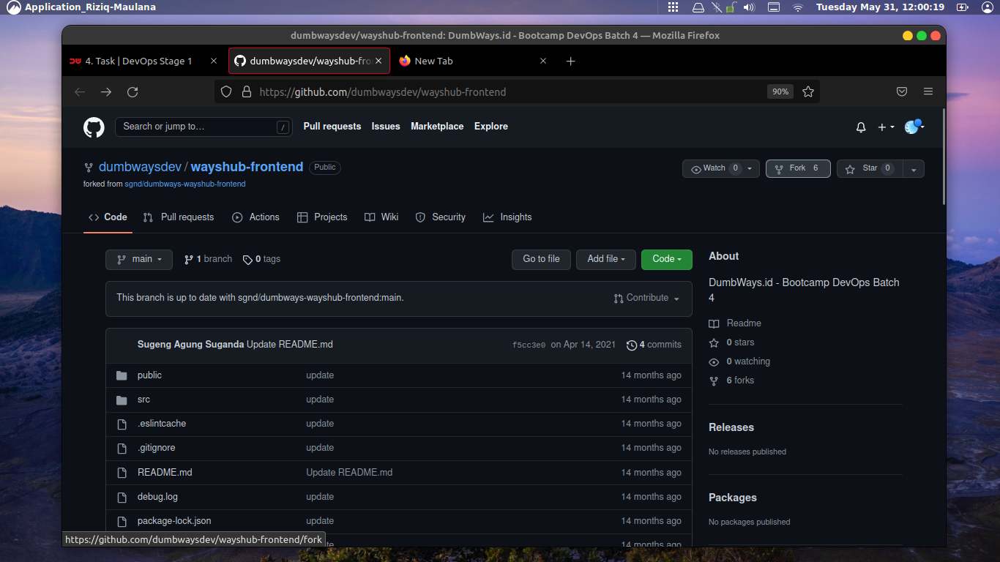

# langsung kita buat fork nya dengan mengikuti gmbar nya ya sperti biasa be by step yh

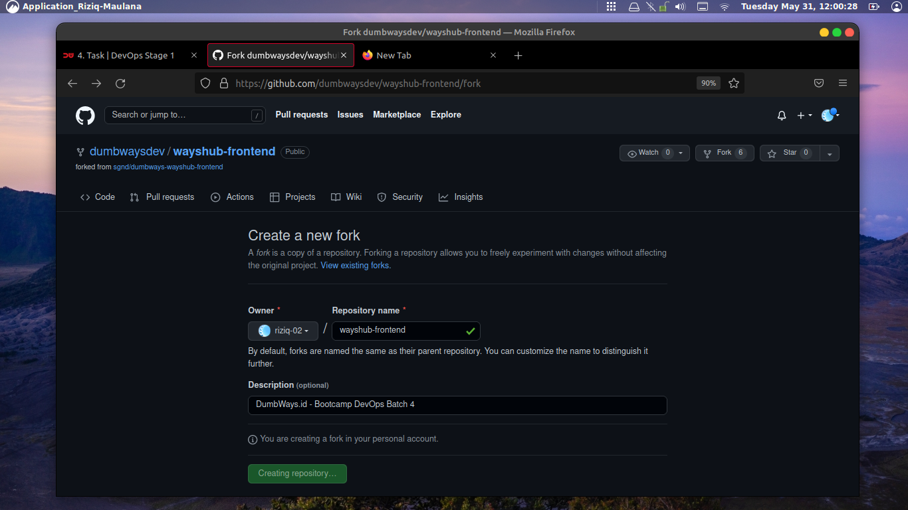

# okeh kita cek apakah udah masuk di repo kita atau belom 

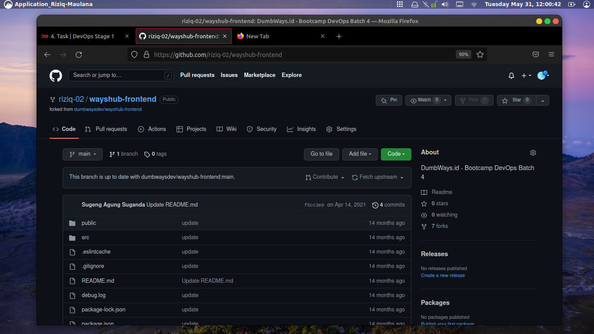

# lalu kita arahkan ke cloudflare pages nya sblum ini saya anggep udah pada punya ya akun cloudflare nya gampang kok buat nya tinggal kunjungi aja, untuk link nya tulis ajah cloudflare di si mbah google kitu ntar ada atau link ini dah klo mager noh https://dash.cloudflare.com/ tuh kurang baik apa coba. nah habis ntu lgsung cekidot ke bagian pages yang ada di jendela kiri bagian tengah tuh kliatan kan nah klik tu disitu, noh gambarnya dibawah lgsung klik connect juga ya jan lupa tuh

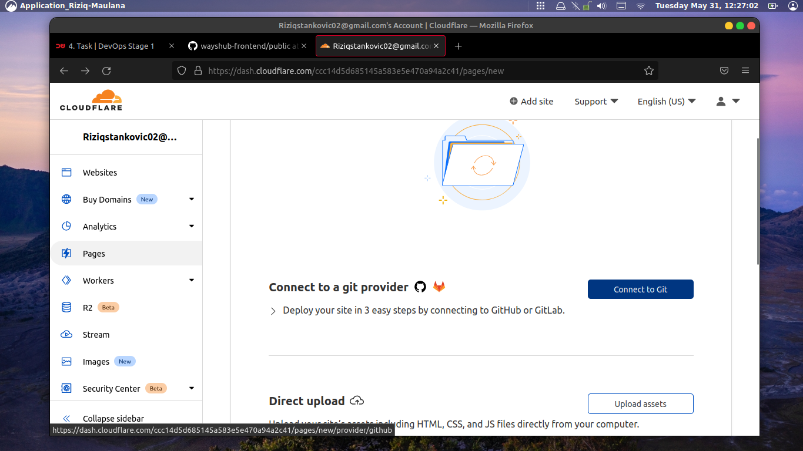

# ikuti step nya yk tar klo kesasar bisa repot dah

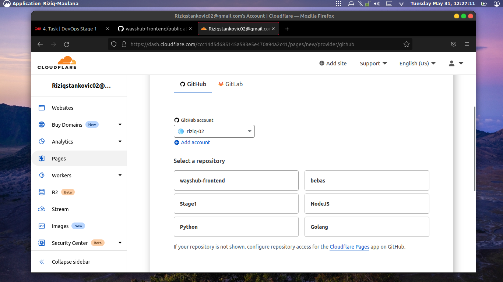

# ceklist yang mau di eksekusi kmudian cekidot ke begin setup

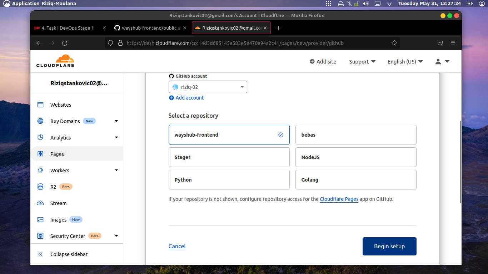

# nah tunggu ampe prosesnya selesai yak, ya sabar sdikit sh calm enggak berminggu-minggu kok


# josss dah slesai tuh cekidot lngsung klik web nya yeayy

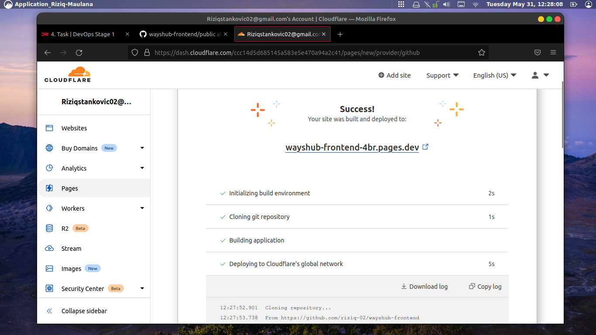

# EEEIIITSSSSSS ntar dlu ndess blom slesai tuh misi lu kan suruh di ganti , makanya yg teliti org magh

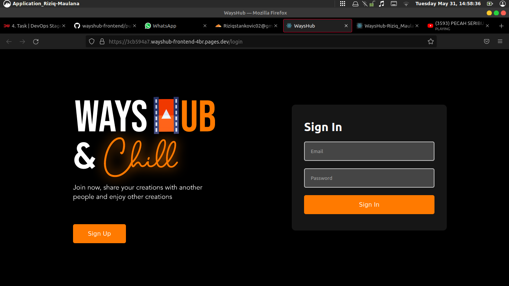

# duh mimin cape nih ngantuk lagi udh mah besok mo otw. okeh langsung aja yk ga usah bertele tele lah kan udah ada tekegram awkwkwk
# kita clone kan ke github dlu kawan buat dieksekusi

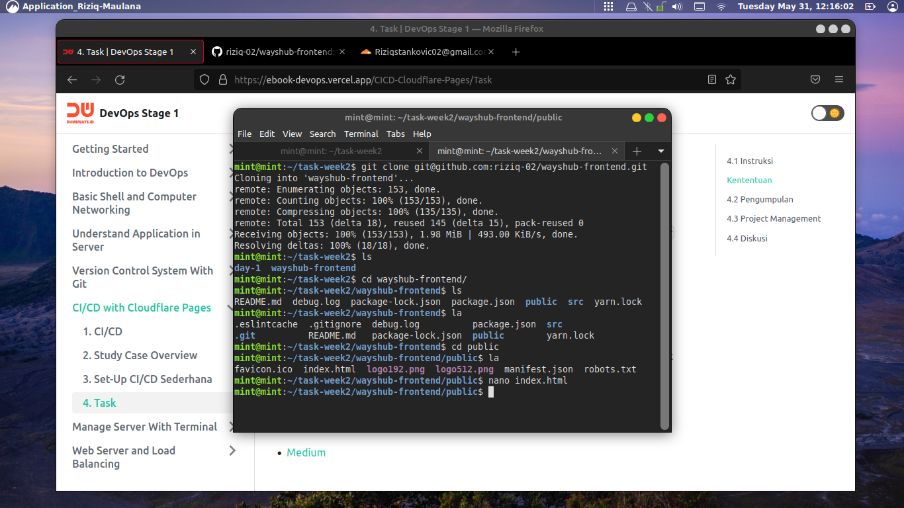

# sbsnernya sh bisa mengunakan perintah 
```
echo 
```
# cuman biar keliatan banyak aja sh tuh terminal hehehe

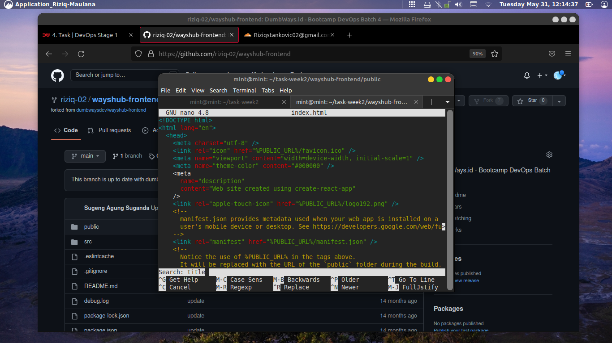

# yokks kita menggunakan shortcut 
```
ctrl + W
```
# set set dah ktmu nih kita ganti ya 

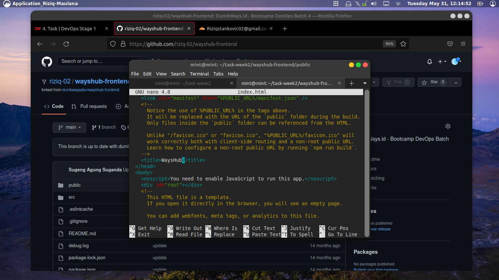

# yg diatas before nih yg dibwah after ya jan kliru kalean ntar salah paham repot lgi dah

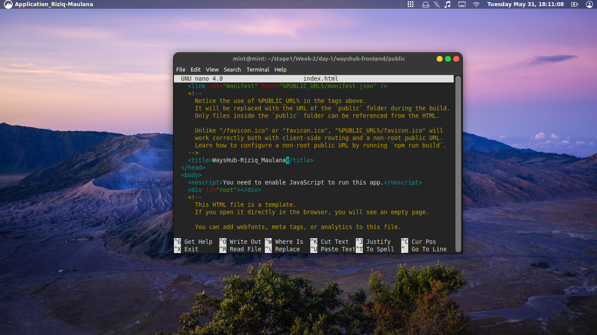

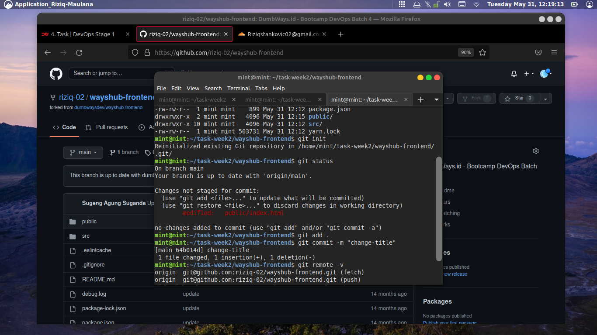

# kmudian ngapain nih? msh inget kan alurnya git status dlu nih buat liat file nya masih jomblo apa kaga, trus add , commit ,set remote trus aplgi yk emmmm dah smua kan lgsung dah kmudian deploy, oh ya btw nih sblum deploy tau kga arti deploy ntu ? nah bner tuh ama kek push push meong wkwkw. mksdnya push github kan yk cuman bedanya klo deploy tuh kek istilah buat push ke arah publik sh biar bsa di liat orng lain ad jg buat buat deploy ke arah web dan lainya , dah tau kan yuk DEPLOYY

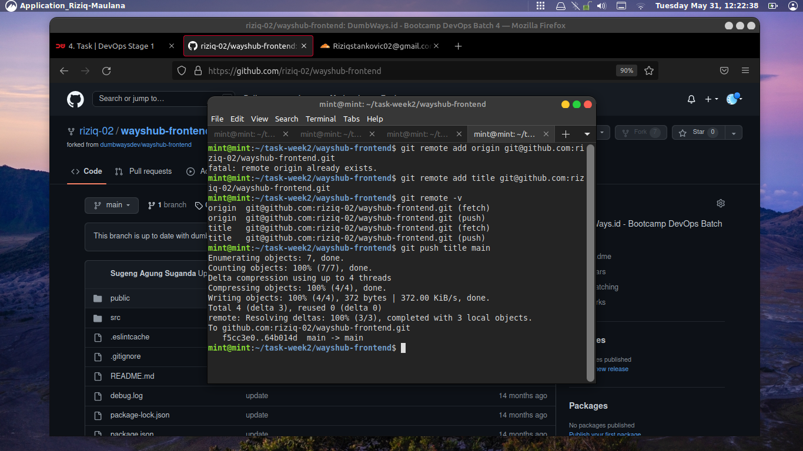

# nih dibawah pasti dah ada perubahan nih lnjut ke github kmudian keee mana yaa. ya ke cloudflare nya atuh kan deploy ke sana okeh

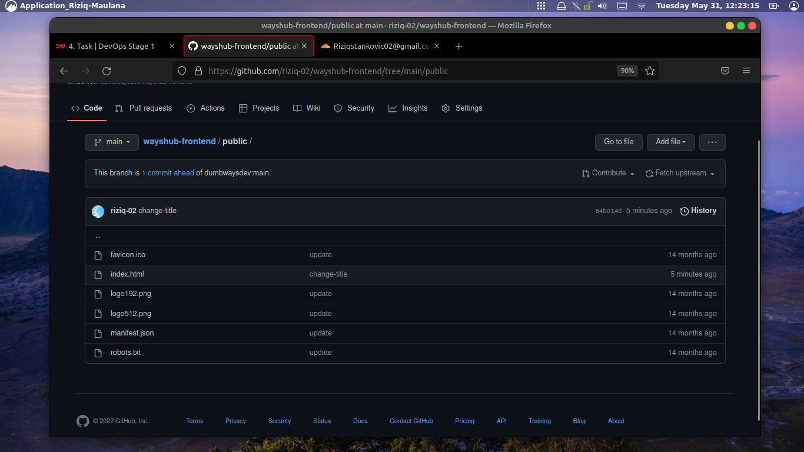

# trus cek cloudflare ntar cemburu deh klo enggak di cek 

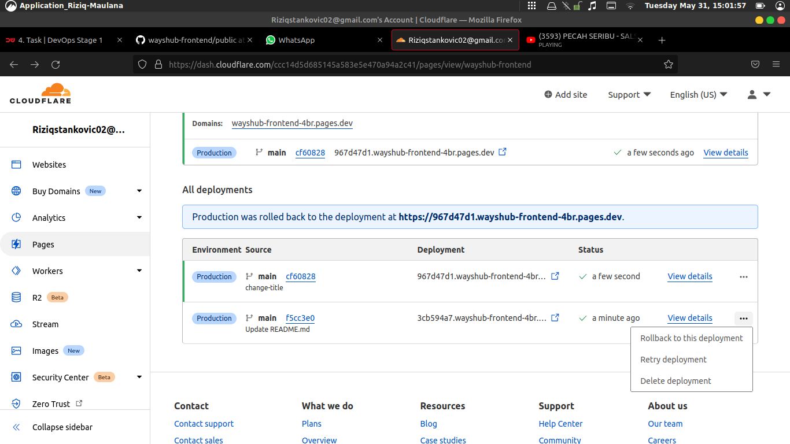

# nohh keliatan kan perubahnya, ada enggak cba cek dengn saksama 
# nah kan buknya keliatan sh cuman ada riwayat nya klo kliatan mah kek nya kurang cpet soalnya lgsung otomatis sh, apalgi lu nya lama bet inet nya ya udah ZONK hasilnya, nggak zonk amat sh mknya di perlihatkan riwayatnya noh ada kan menit nya juga disitu

# oke klo bgitu cek noh link nya, awas jan salam ngklik ntar link kemana-mana repot lgiii susah ntar ingat !!! BE BY STEP yh OKE

 

# wahhh akhirnya kelar juga 
# dah kan, tau lah perubahnya liat tuh di jendela halamanya yg lama ama yg baru ini pasti kliatan lah klo enggak kliatan kek nya ada yg salah deh di pngliaatnyaa, klo kurang jelas monggo  cek di hp tulis sndiri link nya biar matanya nambah jelas. dah ah oke kesimpulnya gitu ajh sh simpel kok tiinggal edit push github deploy edit lgi sdikit trus monitor udh kelar .

# oke Terimakasih smuanyaa dah meluangkan waktunya utk membaca arc ini andddddd Sankyuuuu  


