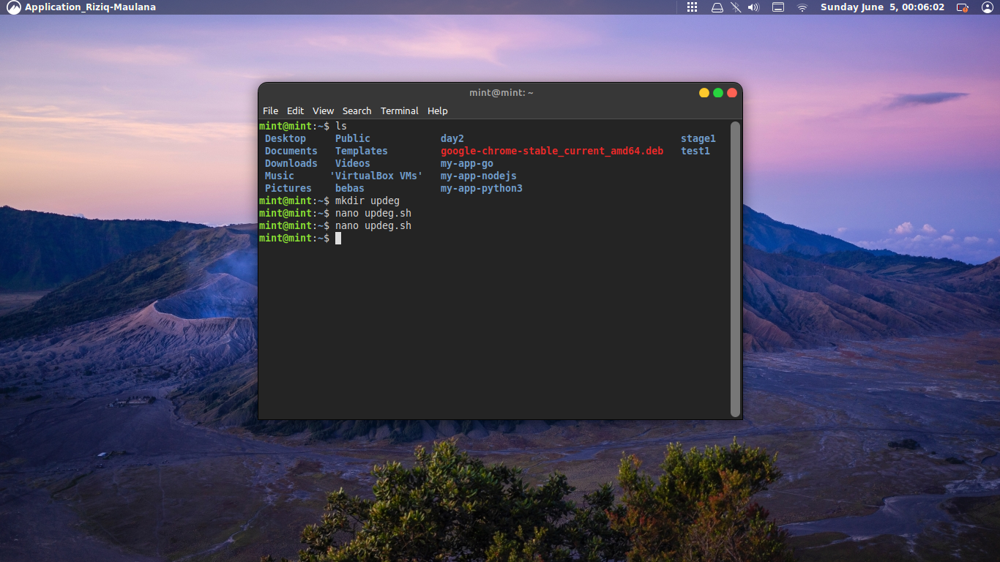
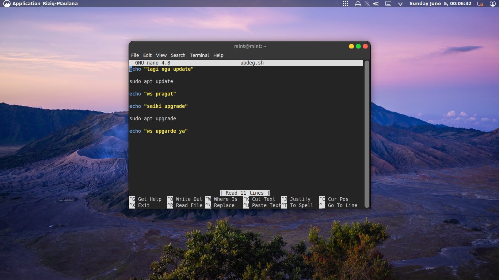
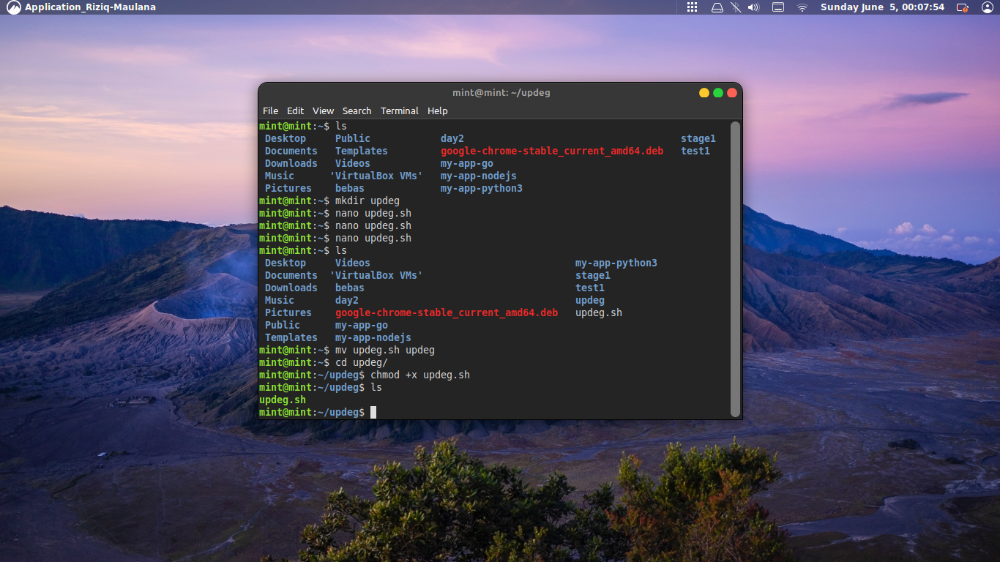
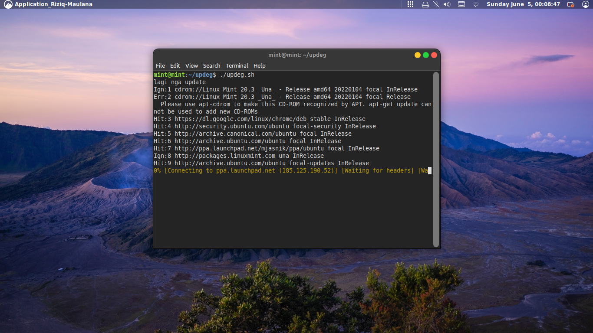
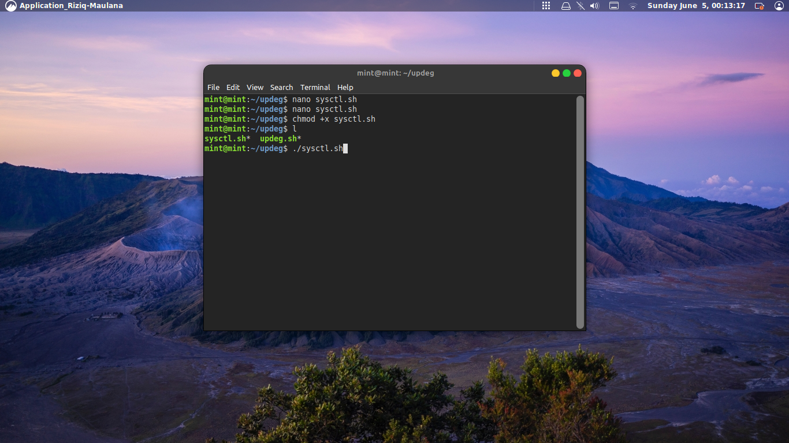
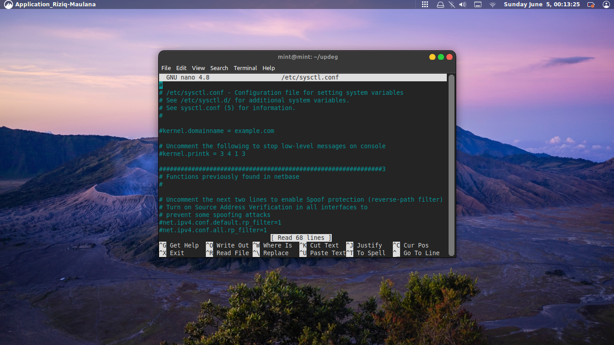
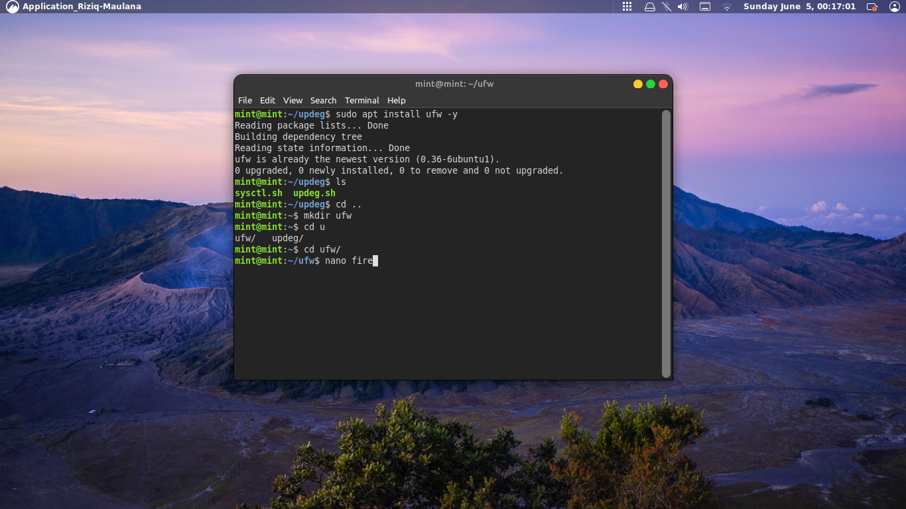
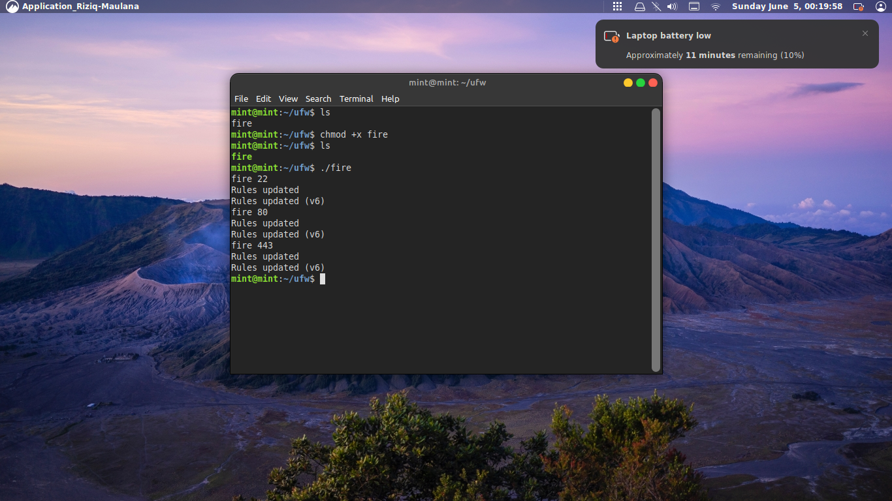
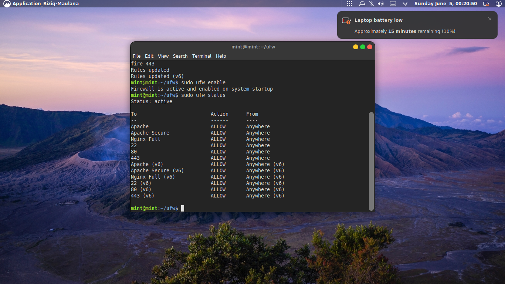

## Konfigurasi environment dan instalasi linux server, dimana server tersebut dapat terkoneksi ke internet dan juga dapat di akses melalui SSH / Browser.

- [ ] Definisikan apa itu Terminal menurut pemahamanmu
- [ ] Jelaskan keuntungan menguasai Terminal
- [ ] Buat sebuah file bash sederhana yang bertugas untuk update dan upgrade sistem
- [ ] Buat sebuah file bash sederhana yang bertugas untuk mencari file bernama `sysctl.conf`
- [ ] Buat sebuah file bash serderhana yang bertugas untuk membuat firewall port 22, 80 dan 443

## Solve 
 
# terminal adalah suatu aplikasi untuk berinterkasi antara manusia denagn system operasi dengan menggunakan bahasa atau perintak tertentu

# manfaat terminal ialah lebih mudah dan simpel untuk berinteraksi secara langsung 

 
 # sekian and sankyu 
